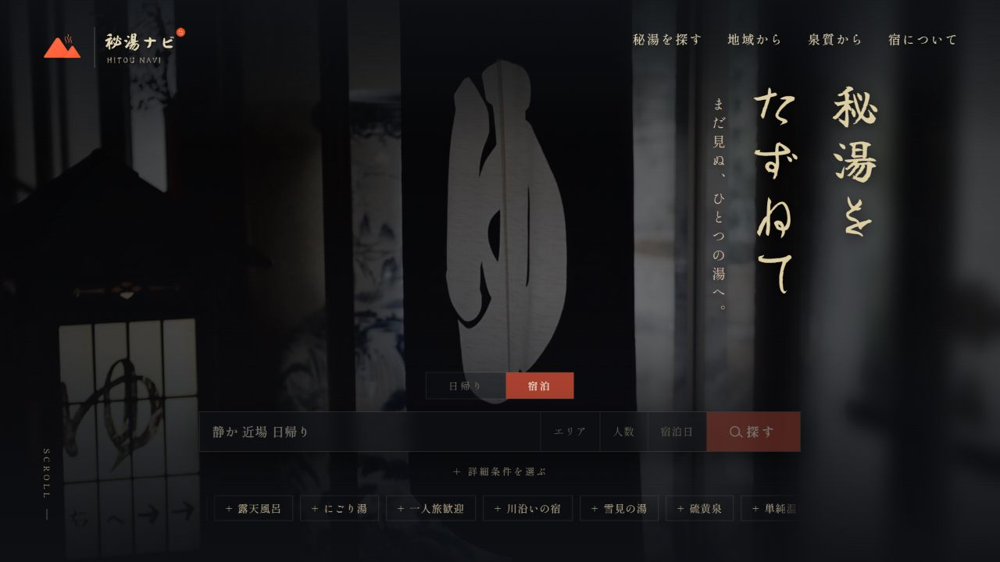
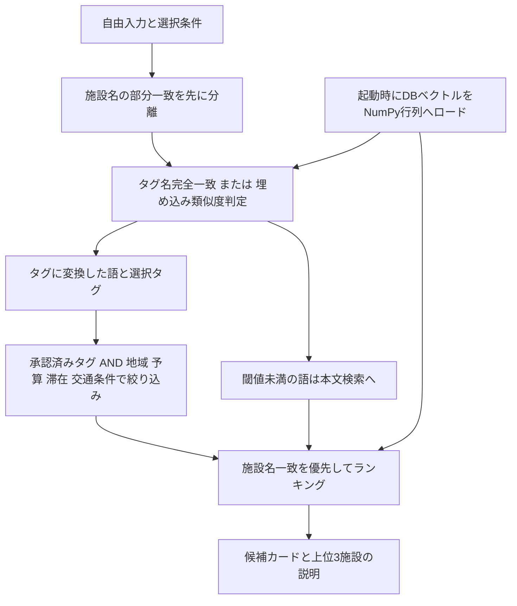

# 秘湯ナビ — hitou_navi

言葉・タグ・地域・予算を組み合わせ、自分に合う温泉を探すフルスタックの制作デモです。

「静か」「にごり湯」のような希望を、施設名検索・タグ判定・本文の意味検索に振り分けます。

React / TypeScript の検索画面と、FastAPI / MySQL / Ruri v3 の検索基盤を実装しています。



ローカルの実UIです（バックエンド未接続のトップ画面）。公開デモURLはこのリポジトリでは案内していません。

## 課題と対象ユーザー

多数の施設を一覧比較する負担を減らし、静けさや一人で過ごしやすさを重視する人が候補を選べる体験を目指しました。条件を絞り、写真や説明を見て最後は人が判断する設計です。現状は検索結果全件をカード列に表示し、上位3施設の説明を掘り下げます。

## 主な機能

- 自由入力、タグ選択、地図からの地域選択、日帰り／宿泊、予算、交通所要時間による検索
- 施設名部分一致の優先表示、承認済みタグのAND絞り込み、本文ベクトル類似度によるランキング
- 検索結果カードと施設詳細の表示
- 埋め込みによるタグ提案と、シードの正解タグ集合に基づく承認／却下の再現
- 開発時のみの検索確認画面 `/search-test`（公開情報だけを使用）

## 技術構成と読む場所

| 層 | 技術・責務 | 主なファイル |
|---|---|---|
| UI | React 19 / TypeScript / Vite / Tailwind CSS / React Router | `frontend/src/pages/TopPage.tsx` |
| API | Python 3.12 / FastAPI / Pydantic | `backend/app/main.py` |
| 検索 | Ruri v3 310m / Sentence Transformers / NumPy | `backend/app/search.py`, `embeddings.py`, `vector_index.py` |
| DB | SQLAlchemy / PyMySQL / MySQL 8 | `backend/app/models.py` |
| 実行環境 | Docker Compose / nginx | `docker-compose.yml`, `frontend/nginx.conf` |

温泉を中心に、泉質・宿泊・アクセス・周辺情報・写真・予約リンク・タグを分離しました。施設とタグは中間テーブルで多対多にし、提案／承認／却下の状態を持たせています。埋め込みにはモデル版・次元・内容ハッシュを保存します。

## 検索アーキテクチャ



タグ名の完全一致はベクトル判定より優先します。それ以外は、通常タグの説明文との最大類似度が `0.82` 以上ならタグに変換し、未満なら本文検索へ回します。本文は見出し・段落で分割し、正規化ベクトルの内積を使います。施設ごとのチャンク最大類似度を語ごとに求め、その平均で順位を付けます。本文検索がない場合や同点の場合は、静けさ・ソロ適性・アクセス難易度の単純合計（暫定の「秘湯度」）を使います。

施設名を先に分離するのは、名前が無関係なタグへ変換され、目的の施設自身が除外される誤りを防ぐためです。名称一致はブーストであり、他の候補を排除しません。小規模な現状では、ベクトルを起動時にメモリ常駐させ、毎回DBから取得するコストを避けています。DB更新・シード後はバックエンド再起動で再読込します。

閾値の試行、誤変換、70m→310mのモデル比較は `search.py` のコメントと `agent-sync/DECISIONS.md` に残しています。タグ提案には施設ごとの上位20%という相対閾値、入力のタグ変換には固定タグ集合に対する絶対閾値を用います。これらは別の判断です。

## データ規模と扱い

付属の `backend/seed.py` は **100施設、89タグ（通常87＋操作用2）、本文500チャンク** のデモデータを作成します。

シードは検索挙動を試すデモデータです。実在する施設名を含みますが、料金・スコア・設備・所要時間・説明には生成した値やテンプレートを含み、写真も複数施設で循環参照します。施設ごとの実写真や最新の旅行情報として利用しないでください。タグ承認も編集者UIでの業務運用ではなく、シードの正解集合による再現です。

## ローカル起動

Docker / Docker Composeを用意します。フロント単体開発にはNode.js 24を使用してください。

```powershell
Copy-Item .env.example .env
# DBパスワードを変更し、DATABASE_URLとMYSQL_*を一致させる
docker compose up --build -d
# 初回はモデル取得・読み込みの完了を待つ
docker compose logs -f backend
```

- UI: `http://localhost`、APIドキュメント: `http://localhost:8000/docs`
- MySQL: `127.0.0.1:33306`（Compose内では `db:3306`）
- 全ポートをloopbackに限定した開発用構成です。公開用のTLS・運用構成は含みません。
- `.env` はgitignore対象です。`.env.example` は例示用です。実在の秘密情報をコミットしないでください。DBパスワードに特殊文字がある場合は、`DATABASE_URL` 内でURLエンコードが必要です。

初回の**空DB**にだけデモデータを投入します。シードは冪等ではなく、既存DBに再実行すると重複制約に抵触します。

```powershell
docker compose exec backend python seed.py
docker compose restart backend
```

Ruri v3 (`cl-nagoya/ruri-v3-310m`) の初回取得にはネット接続、モデル用ディスク容量、推論用メモリが必要です。Hugging Faceキャッシュは `hf_cache` ボリュームに保存します。シードには埋め込み生成の時間がかかります。既存データを消す操作は起動手順に含めません。

フロント編集時は別ターミナルで実行し、`http://127.0.0.1:5173` を開きます。

```powershell
cd frontend
npm ci
npm run dev
```

Viteが `/api` をローカルAPIへプロキシします。開発オリジンから直接APIを呼ぶ場合は、`CORS_ORIGIN=http://127.0.0.1:5173` に合わせ、backendを再作成します。

### 開発用管理APIの安全境界

管理ページ `/admin` とフロント内の固定パスワード判定は撤去しました。**`ENABLE_ADMIN_API=false` が既定値で、管理APIは登録されず404になります。** nginxも `/api/admin` 以下をプロキシしません。

開発で必要な場合に限り、`.env` で `ENABLE_ADMIN_API=true` と、ランダム生成した32文字以上のASCIIトークン `ADMIN_API_TOKEN` を設定し、`docker compose up -d --force-recreate backend` で再作成します。`python -c "import secrets; print(secrets.token_urlsafe(32))"` で生成できます。空・短い・空白を含むトークンでは起動を拒否します。

loopbackの `http://localhost:8000/docs` のAuthorizeでトークンを入力します。全管理APIはサーバー側でBearer認証を検証し、未認証／不正トークンには401を返します。トークンはフロントへ埋め込まず、ログ・URL・Gitへ載せないでください。共有トークンは開発用の簡易認可で、公開管理画面向けのユーザー管理・権限分離・監査機能ではありません。公開環境では管理APIを無効のまま運用する方針です。

## 検証と現在の制約

```powershell
# frontend/
npm run build
npm run lint
# backend/（Python 3.12の専用venvを推奨）
python -m pip install -r requirements-test.txt
python -m unittest discover -s tests -v
python -m compileall -q app seed.py
```

GitHub Actionsはフロントのビルド、App.tsx・SearchTestPage.tsx・vite.config.tsのlint、バックエンド構文・管理認証／検索ロジックの単体テストを実行します。軽量テストはモデル取得・MySQLを必要とせず、本体のモデル推論やDB統合の検証ではありません。

- **Alembic migration未整備**。依存にはあるものの、版管理されたmigrationはありません。`Base.metadata.create_all()` は新規テーブル作成のみで、既存カラム変更を反映しません。今後は現行スキーマを基準版とし、差分migrationをレビュー・バックアップ・検証後に適用する方針です。
- **テストは一部のみ**。管理API境界と固定ベクトルによる検索ロジックの回帰テストを追加しましたが、実モデルの検索品質、DB統合、UI/E2E、性能の自動検証は未整備です。
- **全体lintは未解消**。TopPage.tsxに41エラー・3警告が残っており、CIのlint対象には含めていません。責務分割と型付けが今後の課題です。
- モデル取得・起動時読み込みに失敗するとAPIは起動しません。利用者向けの準備状況表示や復旧案内は未整備です。
- 人数・宿泊日、栞のお気に入り永続化、比較ページ等には表示のみ／デモ動作を含みます。予約・利用者認証は提供していません。
- 秘湯度の合成式、本文との重み配分、複数タグANDで0件の際のフォールバック、TOP3／全件の正式仕様は改善課題です。
- 自動インデックス更新、レート制限、監視、画像・施設情報の出典と更新管理は今後の整備対象です。

## AI支援開発

設計検討・実装補助・レビューにClaude Code / Codexを利用しました。要件・検索体験の方針は開発者が判断し、検索方式・閾値・モデル変更の検討やコード・UI実装にはAIの提案を取り入れています。共同著者表記、Git履歴、`agent-sync/` に開発経緯を残しています。
